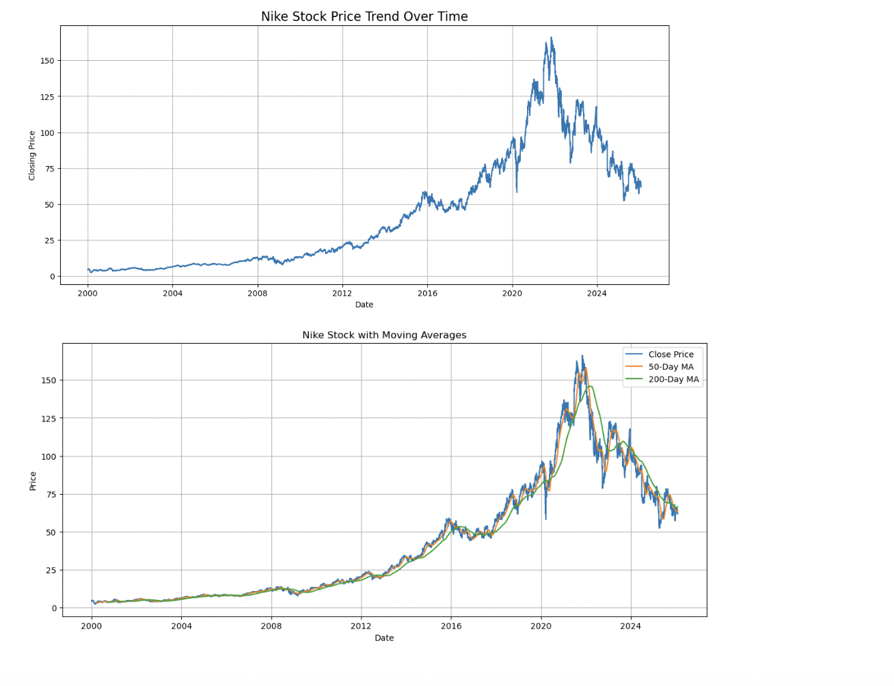
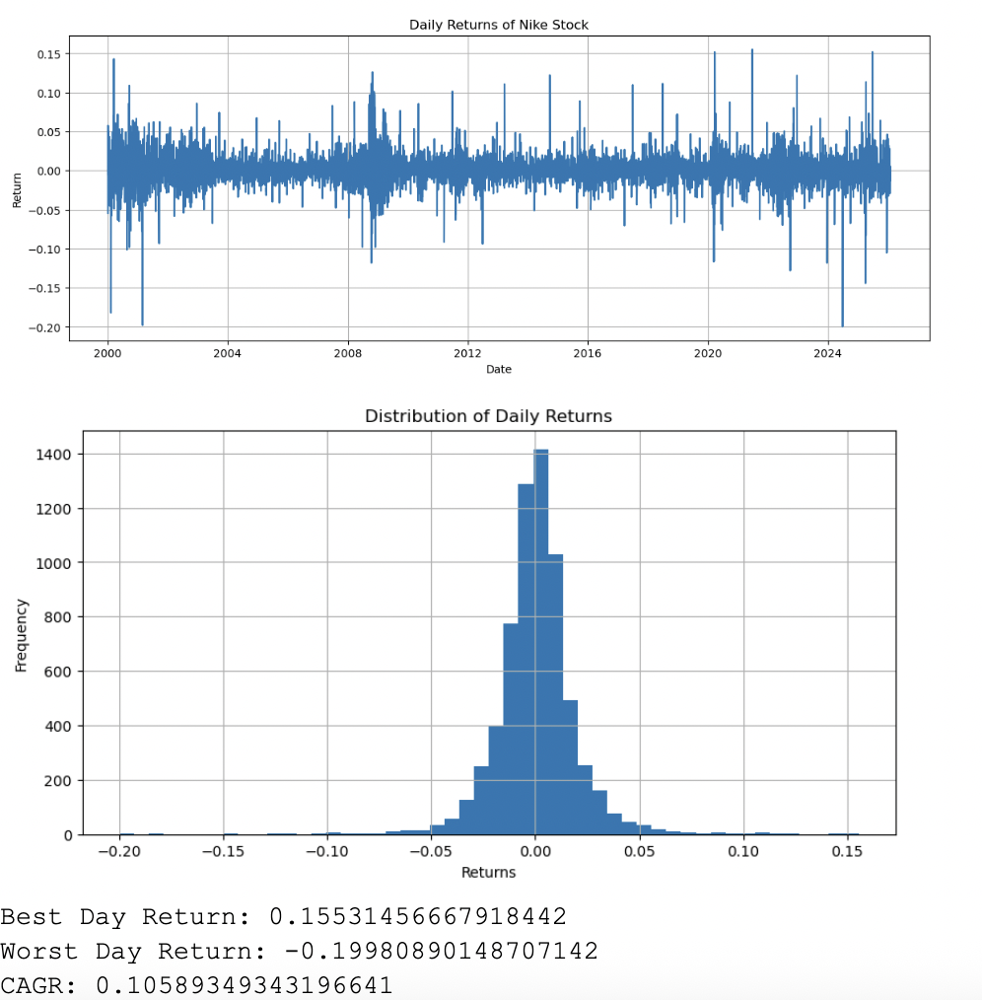
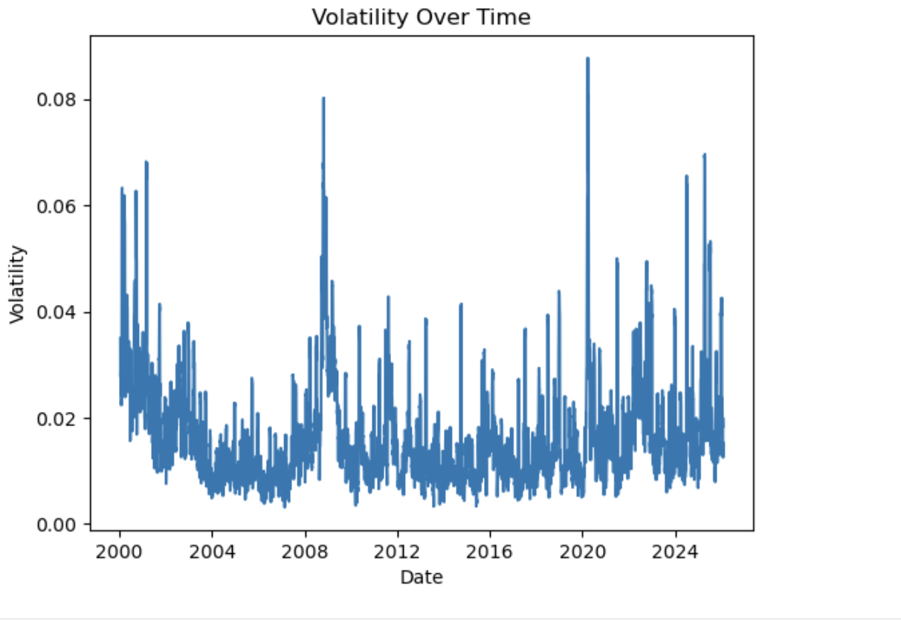
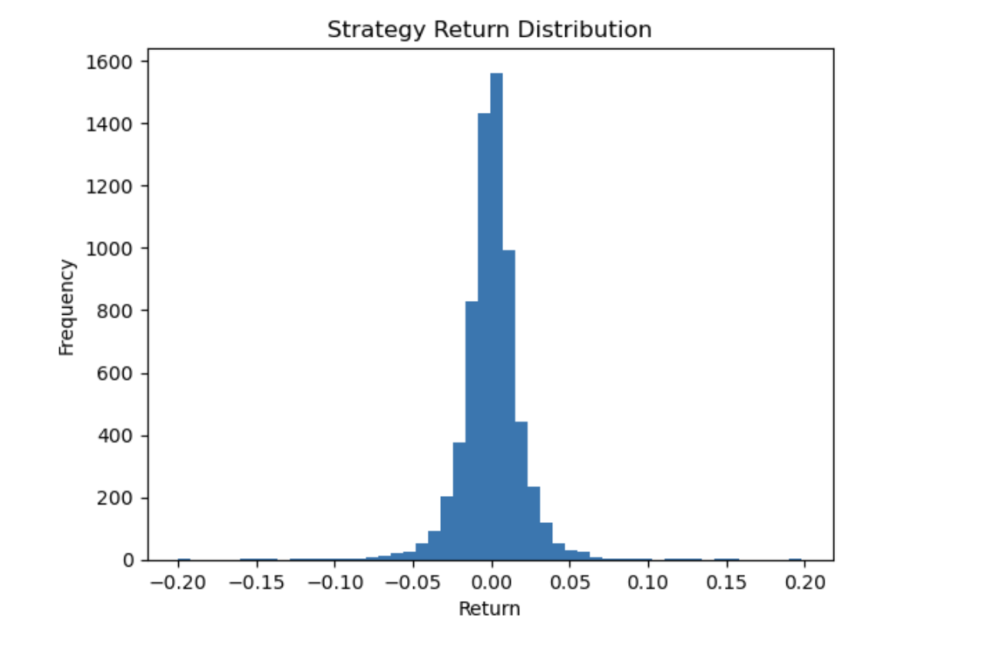
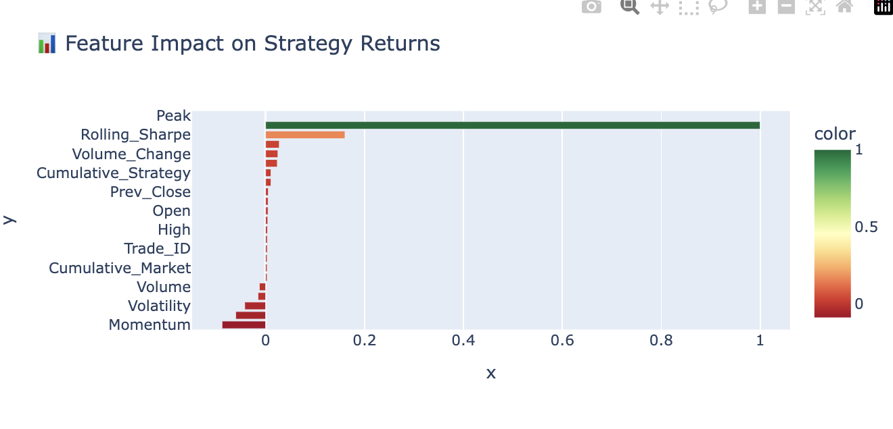

<div align="center">


<br/>

[](https://git.io/typing-svg)

<br/>


</div>

---

## 🎯 Executive Mission

> *"Transform 25 years of raw Nike (NKE) historical stock data into a strategic roadmap for investment decision-making — separating market signals from noise using a high-performance analytics stack."*

This project delivers a **full-cycle quantitative analysis** of Nike Inc. (NKE) stock, covering everything from raw SQL data engineering to interactive Tableau dashboards. The ultimate objective: **evidence-based investment intelligence** that compares algorithmic trading vs. traditional buy-and-hold strategies.

---

## 🏗️ Technical Architecture

```
📦 Nike Stock Analytics Pipeline
 ┣ 📂 data/          → Raw NKE.csv (6,559 records | 2000–2026)
 ┣ 📂 SQL/           → Data engineering, window functions, trading logic
 ┣ 📂 notebook/      → Python EDA, feature engineering, backtesting
 ┣ 📂 dashboard/     → Tableau workbook (.twbx)
 ┣ 📂 images/        → All charts & visualizations
 ┗ 📄 nike (1).pdf   → Full research report
```

<div align="center">

```
  RAW DATA  ──▶  SQL Engineering  ──▶  Python Modeling  ──▶  Tableau Dashboards
  (NKE.csv)      (MySQL Queries)        (Jupyter EDA)         (Interactive VIZ)
      │                 │                     │                      │
   6,559 rows    Window Functions        RSI / MACD / MA        Buy-Sell Signals
   2000–2026     Rolling Averages        Volatility Model        Drawdown Charts
                 Crash Detection         Backtesting             Heatmaps
```

</div>

---

## 🗃️ Part A — Data Engineering (SQL)

> **Foundation:** All time-series logic built directly inside MySQL using window functions, rolling aggregates, and temporal normalization.

### 1️⃣ Daily Returns — How did the stock move day-to-day?

```sql
SELECT
    STR_TO_DATE(Date, '%m/%d/%Y') AS Date,
    Close,
    (Close - LAG(Close) OVER (ORDER BY STR_TO_DATE(Date, '%m/%d/%Y')))
    / LAG(Close) OVER (ORDER BY STR_TO_DATE(Date, '%m/%d/%Y')) AS Daily_Return
FROM nke;
```

<div align="center">

</div>

> 💡 **Insight:** Most daily returns cluster near zero — stable behaviour punctuated by sharp volatility spikes during economic stress periods.

---

### 2️⃣ Annual Volatility — Which years carried the most risk?

```sql
SELECT YEAR(Date) AS Year, STDDEV(Daily_Return) AS Volatility
FROM (
  SELECT STR_TO_DATE(Date, '%m/%d/%Y') AS Date,
    (Close - LAG(Close) OVER (ORDER BY STR_TO_DATE(Date, '%m/%d/%Y')))
    / LAG(Close) OVER (ORDER BY STR_TO_DATE(Date, '%m/%d/%Y')) AS Daily_Return
  FROM nke
) t
GROUP BY Year
ORDER BY Volatility DESC;
```

<div align="center">

</div>

> 💡 **Insight:** Volatility peaks during the **Dot-com bust (2000–02)**, **Global Financial Crisis (2008)**, and **COVID-19 (2020)** — confirming macro-event driven risk clustering.

---

### 3️⃣ ROI Calculator — $1,000 invested in 2010?

```sql
SELECT
    1000 AS Initial_Investment,
    (
        (SELECT Close FROM nke ORDER BY STR_TO_DATE(Date, '%m/%d/%Y') DESC LIMIT 1)
        / (SELECT Close FROM nke WHERE YEAR(STR_TO_DATE(Date, '%m/%d/%Y')) = 2010
           ORDER BY STR_TO_DATE(Date, '%m/%d/%Y') LIMIT 1)
    ) * 1000 AS Final_Value;
```

<div align="center">

</div>

> 💡 **Insight:** A $1,000 investment in 2010 grew **dramatically**, validating the long-term buy-and-hold superiority over active trading strategies.

---

### 4️⃣ Trading Strategy Logic — Buy the Dip

```sql
WITH base AS (
  SELECT STR_TO_DATE(Date, '%m/%d/%Y') AS Date, Close FROM nke
),
returns AS (
  SELECT Date, Close,
    (Close - LAG(Close) OVER (ORDER BY Date)) / LAG(Close) OVER (ORDER BY Date) AS Daily_Return,
    LEAD(Close, 30) OVER (ORDER BY Date) AS Sell_Price
  FROM base
),
trades AS (
  SELECT Date AS Buy_Date, Close AS Buy_Price, Sell_Price,
    (Sell_Price - Close) / Close AS Trade_Return
  FROM returns
  WHERE Daily_Return < -0.05          -- Buy after >5% drops
)
SELECT
    COUNT(*) AS Total_Trades,
    AVG(Trade_Return) AS Avg_Return,
    SUM(CASE WHEN Trade_Return > 0 THEN 1 ELSE 0 END) / COUNT(*) AS Win_Rate,
    SUM(Trade_Return) AS Total_Return
FROM trades;
```

<div align="center">

</div>

> 🏆 **Result:** **53% Win Rate** | **159% Cumulative Return** — The dip-buying strategy exploits market overreaction to generate consistent alpha.

---

### 5️⃣ Moving Average Buy/Sell Signals

```sql
SELECT trade_signal, COUNT(*) AS total_signals
FROM (
  SELECT STR_TO_DATE(Date, '%m/%d/%Y') AS dt, Close,
    CASE
      WHEN Close > AVG(Close) OVER (
        ORDER BY STR_TO_DATE(Date, '%m/%d/%Y')
        ROWS BETWEEN 49 PRECEDING AND CURRENT ROW
      ) THEN 'BUY'
      ELSE 'SELL'
    END AS trade_signal
  FROM nke
) t
GROUP BY trade_signal;
```

<div align="center">

</div>

> 💡 **Insight:** Price crossing the 50-day MA generates actionable signals. Multi-day holding periods evaluated to better reflect real-world execution vs. next-day returns.

---

### 6️⃣ Crash Detection — Identifying Extreme Downside Events

```sql
SELECT * FROM (
  SELECT STR_TO_DATE(Date, '%m/%d/%Y') AS Date, Close,
    (Close - LAG(Close) OVER (ORDER BY STR_TO_DATE(Date, '%m/%d/%Y')))
    / LAG(Close) OVER (ORDER BY STR_TO_DATE(Date, '%m/%d/%Y')) AS Daily_Return
  FROM nke
) t
WHERE Daily_Return < -0.05
ORDER BY Date;
```

<div align="center">

</div>

> 💡 **Insight:** Crash clusters align with **2008 GFC** and **COVID-19** — recovery speed differs significantly across periods, informing risk-aware entry strategies.

---

## 🐍 Part B — Quantitative Analysis (Python)

> **Engine:** Jupyter Notebook-based EDA, technical indicator engineering, volatility modeling, and strategy backtesting.

### 📊 Dataset Overview

| Metric | Value |
|--------|-------|
| 📅 Date Range | Jan 3, 2000 → Jan 30, 2026 |
| 📋 Total Records | 6,559 rows |
| 📉 Lowest Price | ~$2.47 |
| 📈 Highest Price | $166.25 |
| 💹 Avg Closing Price | ~$42.20 |
| 📊 Avg Daily Return | ~0.06% |
| 🚀 Best Day | +15.53% (Jun 25, 2021) |
| 💥 Worst Day | -19.98% (Jun 28, 2024) |

---

### 7️⃣ Long-Term Stock Performance & Moving Average Analysis

<div align="center">


</div>

> 💡 **Insight:** Nike shows **strong multi-decade growth** with a clear 2021 peak followed by a correction. 50-day and 200-day MA crossovers effectively signal **Golden Cross** (bullish) and **Death Cross** (bearish) entry/exit points.

---

### 8️⃣ Trading Strategy vs Buy-and-Hold Comparison

<div align="center">


</div>

> ⚠️ **Key Finding:** Despite maintaining >50% win rates, **active trading strategies consistently underperform** simple buy-and-hold over 20-year horizons. Transaction costs and missed upside compound this gap significantly.

---

### 9️⃣ Distribution of Daily Returns

<div align="center">

</div>

> 💡 **Insight:** Returns follow a **leptokurtic distribution** — fat tails on both sides indicate that extreme gains and losses occur more frequently than a normal distribution would predict. Tail risk management is essential.

---

### 🔟 Feature Correlation Heatmap

<div align="center">

</div>

> 💡 **Insight:** Price-related features (Close, Open, High, Low, Moving Averages) are **highly correlated** — they carry similar information. Volume features are **weakly correlated** with price, making them complementary rather than redundant inputs for modeling.

---

### 1️⃣1️⃣ Rolling Volatility Over Time

<div align="center">

</div>

> 💡 **Insight:** The 10-day rolling standard deviation reveals **volatility clustering** — extended calm periods punctuated by sudden explosive spikes during macro events. This validates GARCH-type risk models for Nike.

---

### 1️⃣2️⃣ Profit vs Loss Distribution

<div align="center">

</div>

> ⚠️ **Critical Finding:** Significant overlap between gain and loss distributions — the strategy's predictive power is **weak**. Losses slightly exceed profits in magnitude, resulting in a **negative overall return** despite a ~50% win rate. This exposes a **poor risk-reward ratio**.

---

### 1️⃣3️⃣ Rolling Sharpe Ratio — Is the Strategy Consistent?

<div align="center">

</div>

> ⚠️ **Critical Finding:** Frequent negative Sharpe values and high temporal variance confirm the trading strategy is **unreliable across different market regimes**. Time-based performance is highly inconsistent — reinforcing buy-and-hold superiority.

---

## 📊 Part C — Strategic Visualization (Tableau)

<div align="center">

> 🔗 **[View Interactive Tableau Dashboard →](dashboard/)**


</div>

### Dashboard Panels Explained

| Panel | What It Shows | Key Takeaway |
|-------|--------------|--------------|
| 📈 **Stock Trend** | 25-year price trajectory | Strong growth, 2021 peak, correction phase |
| 🎯 **MA Signals** | BUY/SELL crossover markers | Entry/exit points via Golden & Death Cross |
| 📉 **Daily Returns** | Return distribution heatmap | Mostly stable; spikes = crisis events |
| 🔻 **Drawdown** | Maximum loss from peak | 2008 & COVID-19 show deepest drawdowns |
| 🗓️ **Monthly Heatmap** | Seasonal return patterns | Identifies strong vs. weak calendar months |
| ⚖️ **Trading vs. Holding** | Strategy comparison | Buy-and-hold wins consistently |

---

## 💡 Strategic Business Insights

<details>
<summary><b>📍 The 2021 Peak & Market Correction</b></summary>

<br/>

November 2021 marked Nike's **all-time high**. The subsequent decline was not random — it was a structured correction phase driven by:
- Post-pandemic supply chain pressures
- Rising inflation and rate hikes
- Consumer spending normalization

**Actionable Insight:** Recognizing correction patterns allows better timing for capital entry and exit.

</details>

<details>
<summary><b>⚖️ Algorithmic Strategy vs. Buy-and-Hold</b></summary>

<br/>

| Metric | MA Crossover Strategy | Buy-and-Hold |
|--------|----------------------|--------------|
| Win Rate | ~53% | N/A |
| Cumulative Return | ~159% | Significantly Higher |
| Transaction Costs | High | Minimal |
| Missed Upside | Frequent | None |

**Verdict:** For high-growth assets like Nike, **"Time in the Market"** beats **"Market Timing"** over long horizons.

</details>

<details>
<summary><b>🌡️ Volatility as a Risk Signal</b></summary>

<br/>

Days with price swings exceeding **±3%** cluster reliably during:
- 📉 Dot-com bust (2000–2002)
- 🏦 Global Financial Crisis (2008)
- 🦠 COVID-19 Pandemic (2020)

**Application:** These volatility clusters are critical inputs for **institutional stop-loss calibration** and **risk-adjusted position sizing**.

</details>

---

## 🛠️ Technical Challenges & Solutions

| Challenge | Solution Applied |
|-----------|----------------|
| 🗓️ Date format inconsistency | `STR_TO_DATE()` normalization + Python ETL pipeline ensuring all 6,559 records indexed by time |
| 📊 Signal noise in daily returns | Smoothing via 50-day & 200-day rolling averages to extract underlying trend |
| 🔁 Realistic backtesting | Multi-day holding periods simulated (30-day windows) vs. naive next-day returns |
| 📉 Feature redundancy | Correlation heatmap analysis to identify and remove collinear inputs |

---

## 🎓 Technical Skills Demonstrated

<div align="center">


</div>

| Category | Tools & Concepts |
|----------|----------------|
| **Languages** | SQL (MySQL), Python |
| **Python Libraries** | Pandas, NumPy, Matplotlib, Seaborn |
| **BI Tools** | Tableau Desktop |
| **Environments** | Jupyter Notebooks |
| **Finance Concepts** | RSI, MACD, Moving Averages, Sharpe Ratio, Drawdown, Volatility Clustering |
| **Engineering** | Time-Series Normalization, ETL Pipeline, Rolling Aggregations, Feature Engineering |
| **Strategy** | Backtesting, Win Rate Analysis, Risk/Return Optimization, Market Cycle Identification |

---

## 🏁 Conclusion

<div align="center">

```
┌─────────────────────────────────────────────────────────────┐
│                    KEY TAKEAWAYS                            │
│                                                             │
│  📈  Nike shows strong long-term growth (2000–2026)         │
│  🎯  2021 peak followed by structured correction phase      │
│  ⚖️  Buy-and-hold outperforms active trading strategies     │
│  🌡️  Volatility clusters during macro economic events       │
│  🔍  RSI + MACD enhance signal quality but not enough       │
│  💡  Long-term market alignment beats market timing         │
└─────────────────────────────────────────────────────────────┘
```

</div>

This project demonstrates mastery of the **full data analytics lifecycle** — from ingestion and cleaning through advanced modeling to executive-level visual storytelling. The findings prove that while technical indicators are powerful risk-mitigation tools, Nike's long-term fundamentals reward **disciplined, patient capital** over algorithmic short-termism.

---

<div align="center">

**⭐ Star this repo if you found it useful!**


*Built with ❤️ using SQL · Python · Tableau*

</div>
