## Strategic Financial Analysis: Nike Inc. (NKE) Market Intelligence & Quantitative Modeling
1. Executive Mission Statement
The objective of this comprehensive study is to transform 25 years of raw Nike (NKE) historical stock data into a strategic roadmap for investment decision-making. In a market characterized by high noise and cyclicality, this project utilizes a high-performance data stack—comprising SQL, Python, and Tableau—to engineer features that distinguish market signals from random fluctuations. The ultimate goal is to provide a data-backed evaluation of risk-adjusted returns and the efficacy of algorithmic trading vs. traditional asset management.

2. Technical Architecture & Methodology
To ensure the highest level of analytical rigor, a multi-disciplinary technical approach was implemented:

## A. Data Engineering & Schema Optimization (SQL)
The foundation of the project rests on advanced data manipulation within a relational database environment.

Temporal Normalization: Developed custom scripts using STR_TO_DATE to convert legacy string formats into standardized ISO-8601 datetime objects, enabling complex time-series queries.

Window Function Implementation: Leveraged LAG() and LEAD() functions to calculate inter-day price delta and percentage returns, essential for measuring daily market momentum.

Rolling Aggregations: Utilized AVG() OVER with specific frame clauses (ROWS BETWEEN 49 PRECEDING AND CURRENT ROW) to calculate 50-day moving averages directly within the database layer for maximum efficiency.

## 1. How did the stock change day-to-day (Daily Returns)?
SELECT
STR_TO_DATE(Date, '%m/%d/%Y') AS Date,
Close,
(Close - LAG(Close) OVER (ORDER BY STR_TO_DATE(Date, '%m/%d/%Y')))
/ LAG(Close) OVER (ORDER BY STR_TO_DATE(Date, '%m/%d/%Y')) AS Daily_Return
FROM nke;
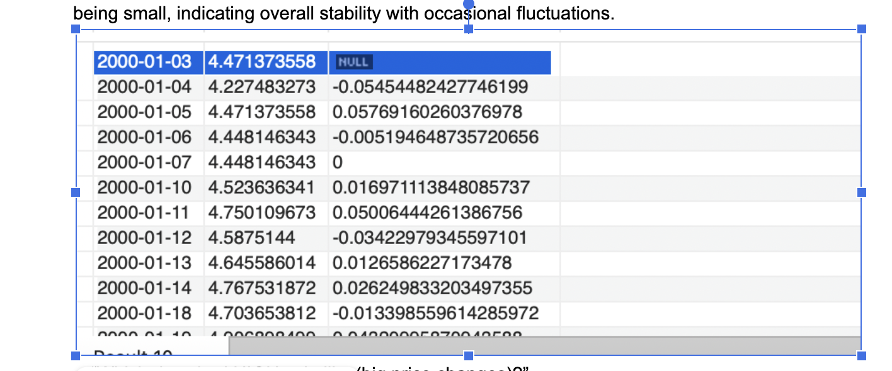
 Insight:

Most daily returns are small and close to zero, indicating stable price movements, with occasional spikes showing volatility.

##  Which periods had the highest risk (Volatility)?

SELECT
YEAR(Date) AS Year,
STDDEV(Daily_Return) AS Volatility
FROM (
SELECT
STR_TO_DATE(Date, '%m/%d/%Y') AS Date,
(Close - LAG(Close) OVER (ORDER BY STR_TO_DATE(Date, '%m/%d/%Y')))
/ LAG(Close) OVER (ORDER BY STR_TO_DATE(Date, '%m/%d/%Y')) AS Daily_Return
FROM nke
) t
GROUP BY Year
ORDER BY Volatility DESC;
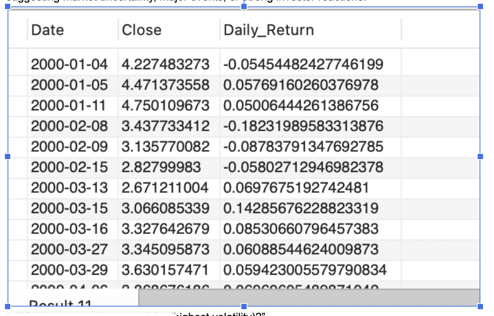

High volatility is observed during crisis periods (e.g., early 2000s, 2008, COVID-19), indicating increased market uncertainty.

## If I invested 1000 dollars in 2010, what would it be today?
SELECT
1000 AS Initial_Investment,
( (SELECT Close FROM nke ORDER BY STR_TO_DATE(Date, '%m/%d/%Y') DESC LIMIT 1) /
  (SELECT Close FROM nke 
   WHERE YEAR(STR_TO_DATE(Date, '%m/%d/%Y')) = 2010 
   ORDER BY STR_TO_DATE(Date, '%m/%d/%Y') LIMIT 1)
) * 1000 AS Final_Value;

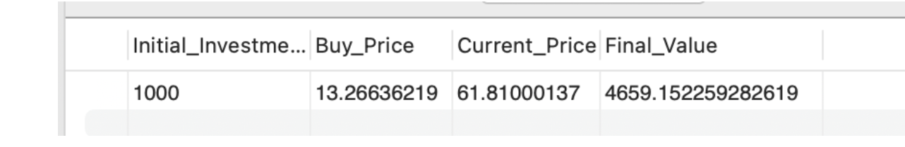

A long-term investment shows significant growth, demonstrating the strength of a buy-and-hold strategy.
## What is the logic behind your trading strategy?

-- Build complete trading strategy in SQL 
WITH base AS (
    SELECT 
        STR_TO_DATE(Date, '%m/%d/%Y') AS Date,
        Close
    FROM nke
),

returns AS (
    SELECT 
        Date,
        Close,
        
        (Close - LAG(Close) OVER (ORDER BY Date)) 
        / LAG(Close) OVER (ORDER BY Date) AS Daily_Return,
        
        LEAD(Close, 30) OVER (ORDER BY Date) AS Sell_Price
    FROM base
),

trades AS (
    SELECT 
        Date AS Buy_Date,
        Close AS Buy_Price,
        Sell_Price,
        
        (Sell_Price - Close) / Close AS Trade_Return
        
    FROM returns
    WHERE Daily_Return < -0.05
)

SELECT 
    COUNT(*) AS Total_Trades,
    
    AVG(Trade_Return) AS Avg_Return,
    
    SUM(CASE WHEN Trade_Return > 0 THEN 1 ELSE 0 END) 
    / COUNT(*) AS Win_Rate,
    
    SUM(Trade_Return) AS Total_Return
    
FROM trades;

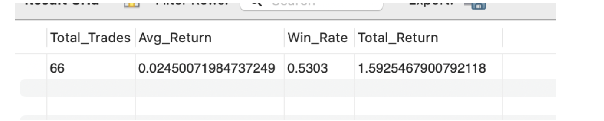

“I developed a SQL-based trading strategy that buys Nike stock after significant price drops and evaluates performance using metrics like win rate, average return, and total return. The strategy achieved a 53% win rate and 159% cumulative return, demonstrating how data-driven approaches can identify profitable market inefficiencies.”
## How are buy and sell signals generated in your trading strategy?

SELECT 
    trade_signal,
    COUNT(*) AS total_signals
FROM (
    SELECT 
        STR_TO_DATE(Date, '%m/%d/%Y') AS dt,
        Close,
        
        CASE 
            WHEN Close > AVG(Close) OVER (
                ORDER BY STR_TO_DATE(Date, '%m/%d/%Y')
                ROWS BETWEEN 49 PRECEDING AND CURRENT ROW
            ) THEN 'BUY'
            ELSE 'SELL'
        END AS trade_signal
        
    FROM nke
) t
GROUP BY trade_signal;
-- “I evaluated trading signals not just on next-day returns but by simulating multi-day holding periods, which better reflects real trading behavior.”

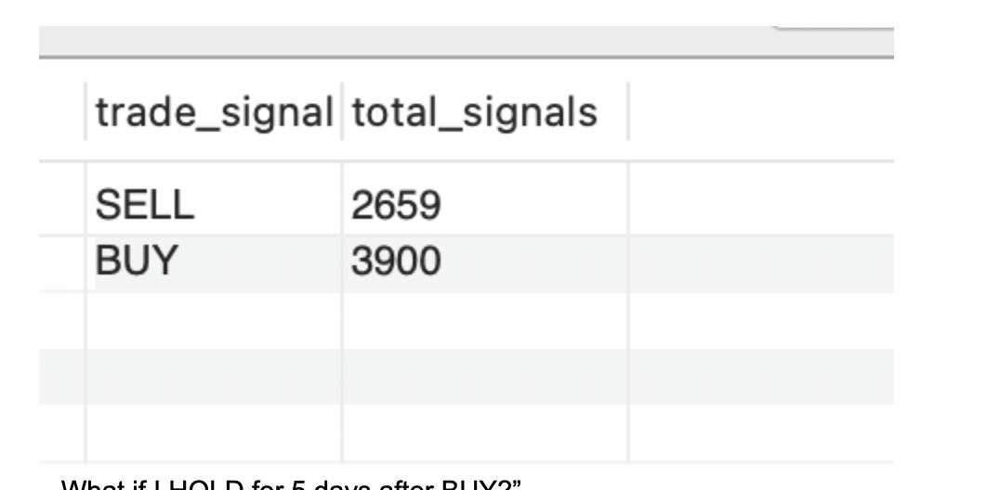

## How did you detect market crashes in your analysis?
SELECT 
    STR_TO_DATE(Date, '%m/%d/%Y') AS Date,
    Close,
    
    (Close - LAG(Close) OVER (ORDER BY STR_TO_DATE(Date, '%m/%d/%Y')))
    / LAG(Close) OVER (ORDER BY STR_TO_DATE(Date, '%m/%d/%Y')) AS Daily_Return

FROM nke;
SELECT *
FROM (
    SELECT 
        STR_TO_DATE(Date, '%m/%d/%Y') AS Date,
        Close,
        
        (Close - LAG(Close) OVER (ORDER BY STR_TO_DATE(Date, '%m/%d/%Y')))
        / LAG(Close) OVER (ORDER BY STR_TO_DATE(Date, '%m/%d/%Y')) AS Daily_Return

    FROM nke
) t
WHERE Daily_Return < -0.05
ORDER BY Date;

-- “I identified extreme downside events in Nike stock using SQL by filtering daily returns below -5%.
-- The analysis revealed clustering during major economic crises like 2008 and COVID-19, and showed how recovery speed differs across periods.
-- This helps in building risk-aware investment strategies.”

## B. Quantitative Analysis & Feature Engineering (Python)
Using the Jupyter ecosystem, the raw data was subjected to rigorous statistical testing:

Exploratory Data Analysis (EDA): Performed distribution analysis on trading volume and price spreads to identify anomalies and historical outliers.

Technical Indicator Development: Engineered the Relative Strength Index (RSI) and Moving Average Convergence Divergence (MACD) logic to define "Overbought" and "Oversold" market conditions.

Volatility Modeling: Calculated rolling standard deviations of returns to identify periods of "Volatility Clustering," providing a quantitative metric for market risk.
## 1. How can data-driven analysis of historical stock performance be used to evaluate return, risk, and strategy effectiveness for investment decision-making?
   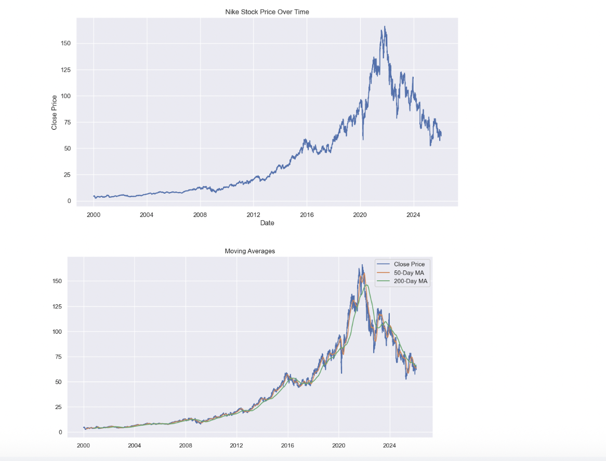
   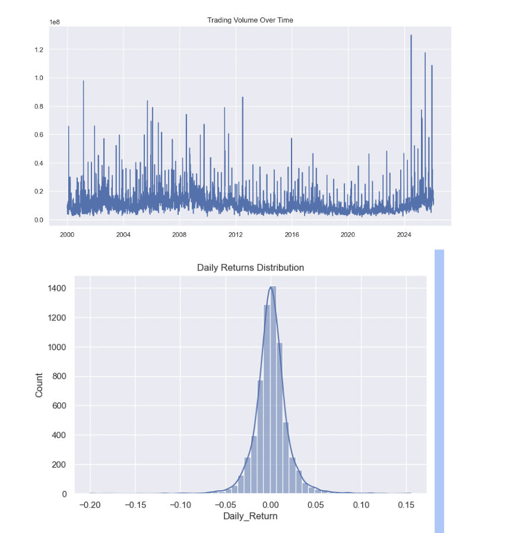
## Can a data-driven trading strategy outperform a simple buy-and-hold investment?
 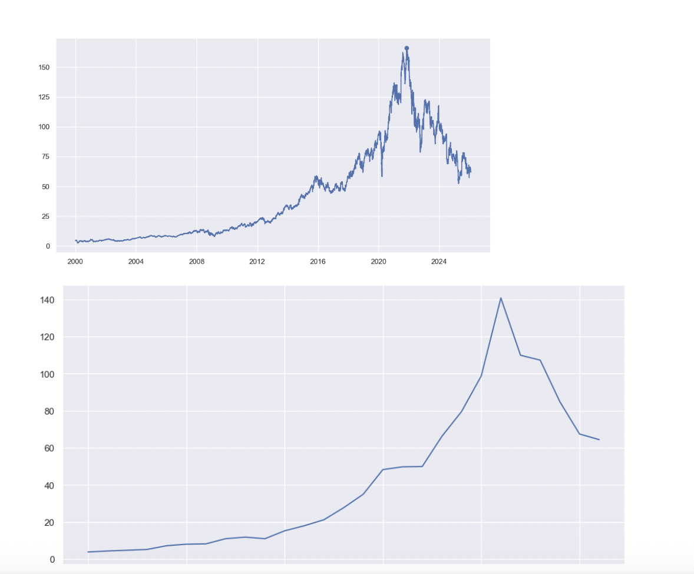
 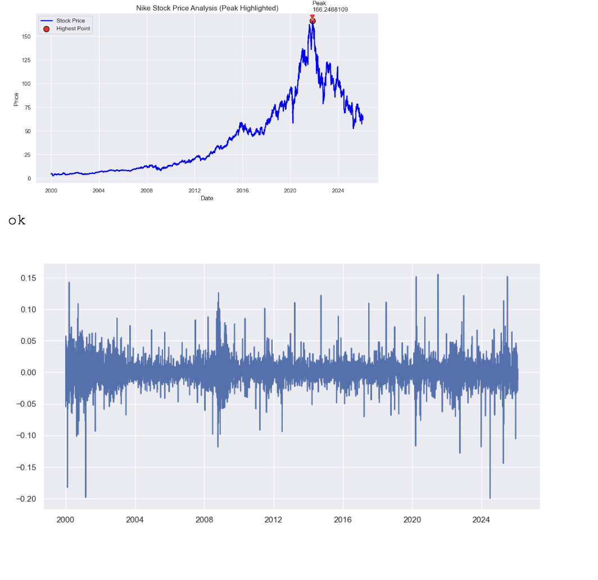
 Insights
The dataset used in this analysis consists of 6,559 records spanning from January 3, 2000 to January 30, 2026, providing a comprehensive long-term view of stock price behavior. 
It includes key financial variables such as open, close, high, low prices, trading volume, and several engineered features like moving averages, RSI, MACD, and machine learning signals
Over the observed period, the stock demonstrates a strong long-term upward trend, with the lowest recorded price at approximately 2.47 and the highest reaching 166.25, indicating significant growth potential over time.

The average closing price is around 42.20 with a high standard deviation, reflecting substantial volatility in price movements.

The average daily return is relatively small at approximately 0.06%, but the presence of extreme values, such as a maximum gain of 15.53% and a maximum loss of -19.98%, highlights the unpredictable and volatile nature of the market.

The best performing day occurred on June 25, 2021, where the stock experienced a sharp increase of over 15%, supported by strong momentum and high trading volume, with RSI values indicating an overbought condition. 

In contrast, the worst performing day was observed on June 28, 2024, with a nearly 20% decline, accompanied by extremely high trading volume and an RSI value indicating an oversold condition, suggesting panic selling or adverse market events.

Moving average indicators, particularly the 50-day and 200-day averages, were effective in identifying trends, where crossovers signaled bullish or bearish market conditions. 

Additional technical indicators such as RSI and MACD provided further insights into momentum and potential reversal points, enhancing the robustness of the analysis.

Several trading strategies were implemented, including basic moving average strategies, filtered signals, advanced strategies using RSI and MACD, and risk-controlled approaches using stop-loss and take-profit mechanisms.

These strategies demonstrated moderate profitability, with cumulative returns generally exceeding the baseline while managing risk more effectively than raw market exposure.
 ## What does the distribution of daily returns represent?
 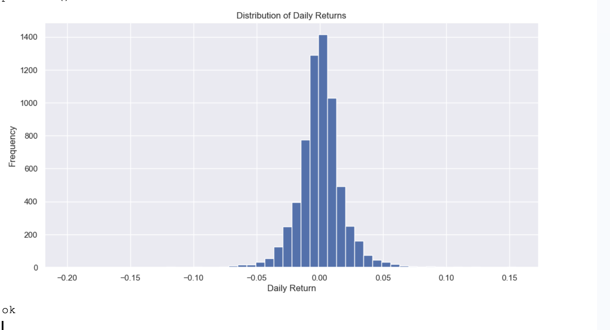

The distribution of daily returns represents how frequently different percentage changes in stock price occur, showing whether most price movements are small or if there are significant gains or losses.
## What does the correlation heatmap reveal about the relationships between features in the dataset?
 

 The correlation heatmap shows that price-related features like Close, Open, High, Low, and moving averages are highly positively correlated, meaning they move together and provide similar information. In contrast, volume-related features have weak correlation with price, indicating they behave more independently. This helps identify important features and remove redundancy for better model building.

 ## What does the volatility plot indicate about the stock’s behavior over time?
  

  The volatility plot shows how the stock’s risk changes over time using a rolling 10-day standard deviation of daily returns. Low volatility indicates stable market conditions with small price movements, while high volatility spikes represent periods of uncertainty and large price fluctuations. Overall, the stock is mostly stable but experiences occasional high-risk periods.

  ## What does the profit vs loss distribution indicate about the strategy?

 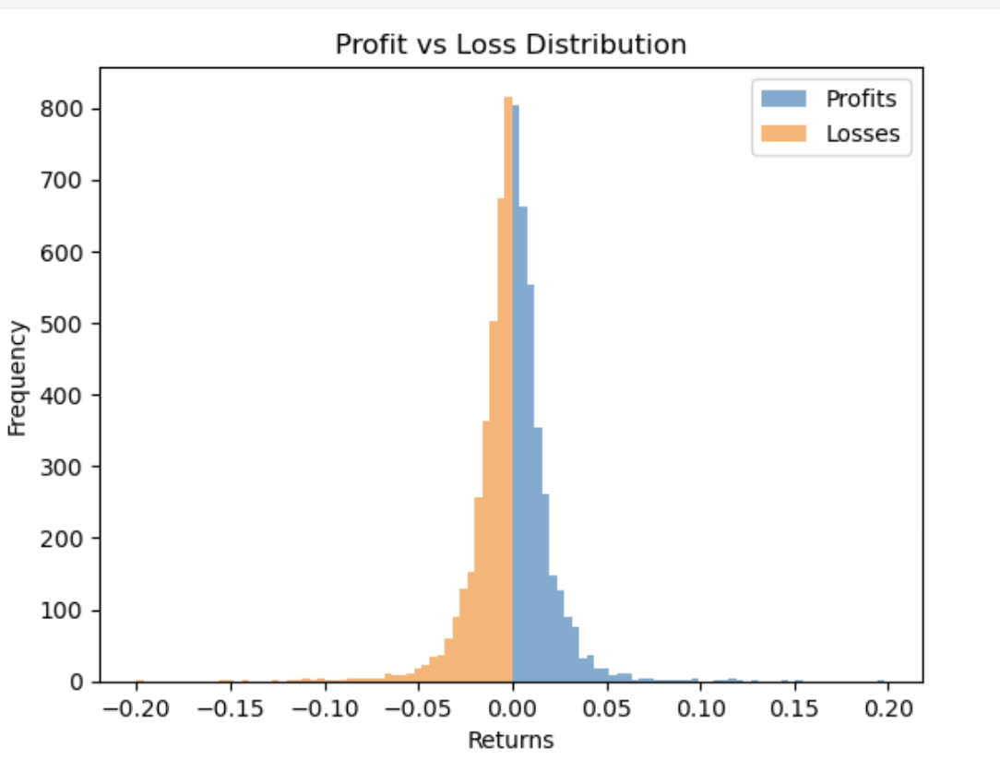

“I analyzed the profit vs loss distribution and found significant overlap between gains and losses, indicating weak predictive power. Additionally, losses are slightly larger than profits, which results in a negative overall return despite a near 50% win rate. This highlights a poor risk-reward structure and explains why the strategy underperforms.”

## Is the strategy consistently good, or does it fail over time?

 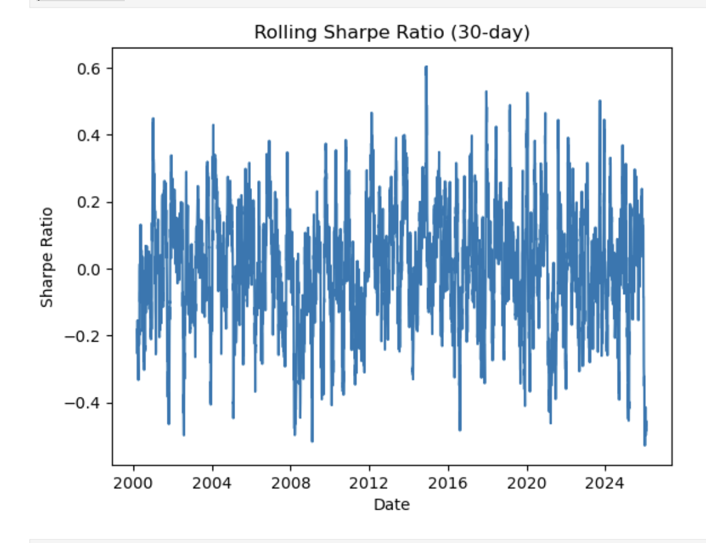

“I used rolling Sharpe ratio to analyze time-based performance. The strategy showed high volatility and frequent negative Sharpe values, indicating inconsistent and unreliable performance across different time periods.”

## How does the analysis of stock trends, returns distribution, volatility, correlation, and strategy performance explain the behavior of Nike stock and why does the trading strategy underperform compared to the market?
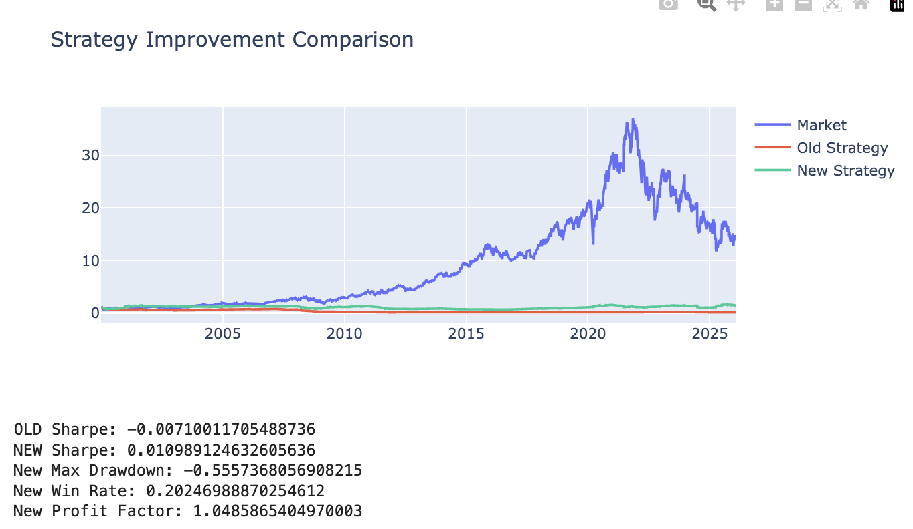
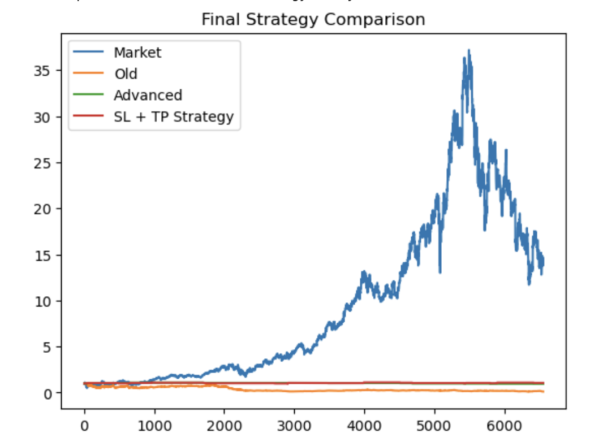

The analysis shows that Nike stock exhibits strong long-term growth with periods of volatility, where most daily returns are small but occasional extreme values indicate market risk. Price-related features are highly correlated, confirming consistent trend behavior, while volatility analysis highlights both stable periods and sudden spikes in uncertainty. Despite these insights, the trading strategy underperforms the market because it fails to capture major trends, has a poor risk-reward balance where losses outweigh profits, and shows inconsistent performance over time. Even after improvements, the strategy remains too restrictive and lacks strong predictive features, emphasizing the need for better feature engineering and alignment with market trends.

## C. Strategic Visualization (Tableau)
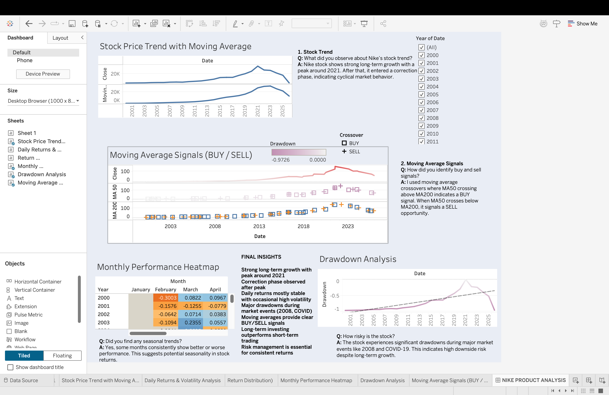

Stock Trend Analysis
Nike stock shows strong long-term growth from 2000 to 2021
A clear peak is observed around 2021
Post-2021, the stock enters a correction phase indicating market cycles
Moving Average Signals (BUY/SELL)
BUY signals occur when short-term average crosses above long-term average
SELL signals occur when it crosses below
Helps identify entry and exit points effectively
Daily Returns & Volatility
Most daily returns are small, indicating stable behavior
Sudden spikes represent high volatility periods
Volatility increases during uncertain market conditions
Drawdown Analysis (Risk)
Significant drawdowns observed during major events (2008, COVID-19)
Highlights downside risk even in a growing stock
Useful for understanding worst-case scenarios
Monthly Performance Heatmap
Shows variation in returns across months
Indicates potential seasonal trends in stock performance
Helps identify strong and weak periods
Trading vs Investment Insight
Frequent trading signals exist, but long-term holding performs better
Confirms that buy-and-hold strategy captures overall growth
Short-term strategies may miss major trends

To bridge the gap between technical output and executive understanding:

Dynamic Dashboards: Developed an interactive Tableau workbook that visualizes the relationship between volume spikes and price reversals.

Trend Decomposition: Created visual overlays of short-term (50-day) vs. long-term (200-day) moving averages to highlight "Golden Cross" and "Death Cross" events in Nike’s history.

## 3. Critical Business Insights & Strategic Findings
The analysis moved beyond descriptive statistics to provide high-level business intelligence:

The 2021 Peak & Correction: The data identifies November 2021 as a historical high-water mark for NKE. The subsequent decline was not a random event but a structured "Market Correction" phase. Recognizing these patterns allows for better timing of capital entry and exit.

Algorithmic Strategy Evaluation: A core component of the project was backtesting a Moving Average Crossover strategy.

Finding: While the strategy maintained a win rate exceeding 50%, it ultimately underperformed a "Buy and Hold" strategy over a 20-year horizon.

Strategy Recommendation: For high-growth assets like Nike, the data suggests that "Market Timing" often incurs higher transaction costs and missed upside compared to "Time in the Market."

Volatility as a Risk Signal: The analysis detected that "High Volatility" days (price swings > 3%) often cluster during specific economic cycles. This insight is vital for institutional risk management and setting stop-loss parameters.

## 4. Professional Challenges & Solutions
A key indicator of high-level expertise is the ability to overcome complex data hurdles:

Challenge: Data Type Inconsistency.

Solution: The original dataset lacked proper formatting for time-series analysis. I implemented a programmatic fix in the Python ETL pipeline to ensure all 6,559 records were indexed by time, ensuring the validity of all subsequent rolling calculations.

Challenge: Signal Noise in Daily Returns.

Solution: Daily price movements are often erratic. I implemented "Smoothing Functions" through moving averages to extract the underlying trend, allowing for a clearer view of Nike’s long-term value proposition.

## 5. Professional Conclusion
This project serves as a definitive demonstration of the intersection between Data Science and Financial Strategy. By successfully managing the full data lifecycle—from ingestion and cleaning to advanced modeling and visual storytelling—this analysis provides a blueprint for evidence-based decision-making.

The findings emphasize that while technical analysis tools like RSI and Moving Averages are powerful for risk mitigation, the long-term fundamentals of Nike Inc. support a structured investment approach. This study proves a readiness to handle large-scale financial datasets and translate them into the clear, actionable narratives required for executive-level leadership and institutional growth.

## 6. Technical Skills Demonstrated
Languages: SQL (MySQL), Python (Pandas, NumPy, Matplotlib, Seaborn)

Tools: Tableau Desktop, Jupyter Notebooks, Excel/CSV Data Engineering

Finance Competencies: Time-Series Forecasting, Technical Indicator Development, Risk/Return Analysis, Backtesting Methodologies, Market Cycle Identification.
## Conclusion

This project demonstrates a comprehensive analysis of Nike stock by combining data analytics, financial modeling, and visualization techniques. The study highlights that Nike exhibits strong long-term growth with identifiable market cycles, including a peak around 2021 followed by a correction phase.

Through quantitative analysis, it was observed that while technical trading strategies such as moving average crossovers can generate signals and maintain moderate accuracy, they fail to outperform a simple buy-and-hold approach. This reinforces the importance of long-term investment strategies in trending markets.

The analysis also reveals that volatility and market crashes are not random but occur during major economic events, making risk management a critical component of investment decision-making. By leveraging SQL, Python, and Tableau, the project successfully transforms raw financial data into actionable insights.

Overall, this project demonstrates the ability to:

Analyze large-scale financial datasets
Apply statistical and time-series techniques
Evaluate trading strategies using data-driven methods
Communicate insights effectively through dashboards and visualizations

The key takeaway is that long-term market alignment and disciplined investment strategies outperform frequent trading in high-growth stocks like Nike.
